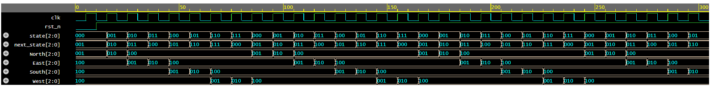

# Traffic Light Controller (SystemVerilog)

## 📌 Overview
This project implements a simple **Traffic Light Controller FSM** in SystemVerilog and verifies it using a self-checking testbench.

## 🏗️ Design
- FSM with eight states cycling through directions: North, East, South, West
- Each direction follows the sequence: `GREEN → YELLOW → RED`
- Asynchronous reset
- Utilizes `always_ff` for state transitions and `always_comb` for output logic

## 🧪 Testbench
- Self-checking testbench with assertions to validate FSM output signals
- Runs simulation for multiple clock cycles to verify all states
- Dumps waveform (`.vcd` file) for visualization in GTKWave

## 📊 Simulation Waveform


## ▶️ How to Run
```bash
#Compile
iverilog -g2012 src/traffic_light_controller.sv tb/tb_traffic_light_controller.sv -o traffic_light.vvp

#Simulate
vvp traffic_light.vvp

#View waveform
gtkwave traffic_light_controller.vcd


## 📁 File Structure
src/
4way_traffic_light_controller.sv # Traffic light controller RTL code
tb/
tb_4way_traffic_light_controller.sv # Testbench source file
waves/
4way_traffic_light_controller_waves.png # Sample waveform screenshot
README.md # Project documentation


## ✒️ Author
Your Brahma Ganesh Katrapalli — your.katrapallibrahmaganesh@gmail.com

---